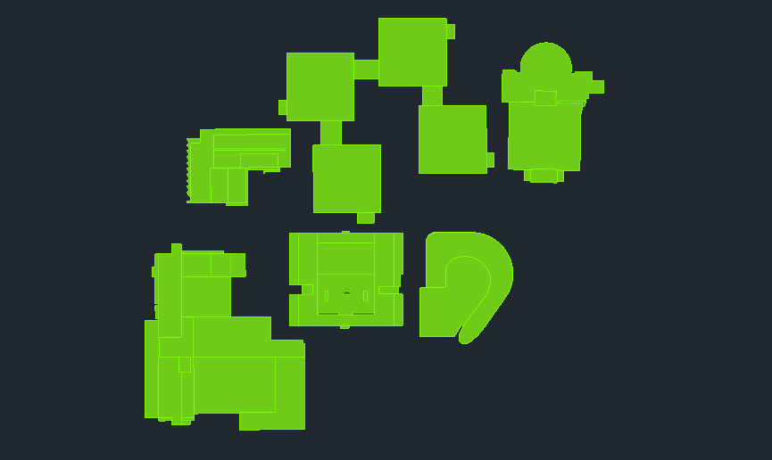
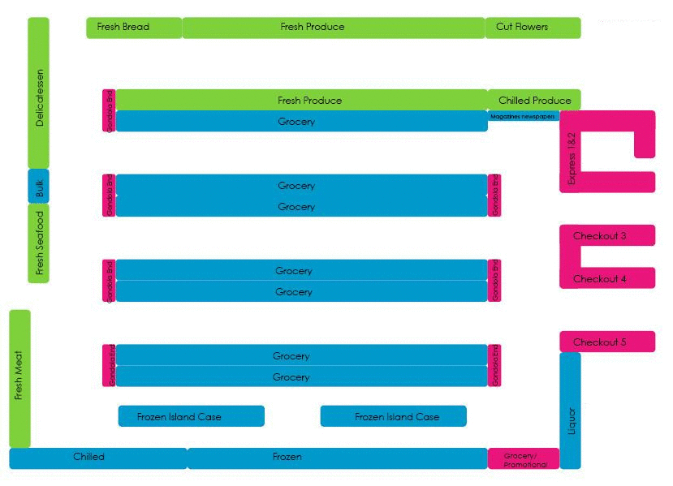

# cell_devs_generator

Auxiliar script to generate Cell-DEVS environments based on images.

```
usage: cd_generator.py [-h] [-a AVOID_SEPARATION] -i IN_FILE [-b BACK_COLOR]
                       [-d DELAY] [-n NEIGHBORHOOD] [-m TOP_NAME]
                       [-o OUT_PATH] [-r RULES_FILE] [-t TOLERANCE] [-w WIDTH]
                       [-bv BACK_VALUE] [-ov OBST_VALUE]

optional arguments:
  -h, --help            show this help message and exit

  -a AVOID_SEPARATION, --avoid_separation AVOID_SEPARATION
                        Avoid separating the obstacles

  -i IN_FILE, --in_file IN_FILE
                        Input image

  -b BACK_COLOR, --back_color BACK_COLOR
                        Background color to separate obstacles

  -d DELAY, --delay DELAY
                        Default delay

  -n NEIGHBORHOOD, --neighborhood NEIGHBORHOOD
                        Neighborhood type (moore, vn, emoore, evn)

  -m TOP_NAME, --top_name TOP_NAME
                        Name of the resulting files

  -o OUT_PATH, --out_path OUT_PATH
                        Output path

  -r RULES_FILE, --rules_file RULES_FILE
                        File with the rules to include in the main file

  -t TOLERANCE, --tolerance TOLERANCE
                        Tolerance when separating background

  -w WIDTH, --width WIDTH
                        Width of the resulting model
  -bv BACK_VALUE, --back_value
                        Value for background cells in .val output file
  -ov OBST_VALUE, --obst_value
                        Value for obstacle cells in .val output file
```

### Examples (obstacle separation)
```
python3 cd_generator.py -i in/carleton_campus.png -w 100 -t 40 -b 33,40,48
```


```
python3 cd_generator.py -i in/store1.jpg -w 100 -t 20
```


### Examples (generated Cell-DEVS files)
#### Main file (.ma)
```
[top]
components : carleton_campus

[carleton_campus]
type : cell
dim : (59,100)
delay : transport
defaultDelayTime : 1000
border : nonwrapped

neighbors :                         carleton_campus(0,-1)
neighbors : carleton_campus(-1,0)   carleton_campus(0,0)    carleton_campus(1,0)
neighbors :                         carleton_campus(0,1)

initialValue : 0
initialCellsValue : carleton_campus.val
localtransition : rules

[rules]

% ...

rule: {(0,0)}   0   { t }
```
#### Initial values file (.val)
```
(41, 19) = 1
(42, 19) = 1
(43, 19) = 1
(44, 19) = 1
(45, 19) = 1
(46, 19) = 1
(47, 19) = 1
...
```
#### Palette file (.pal)
```
[0;1] 0 0 0
[1;2] 255 255 255
```
